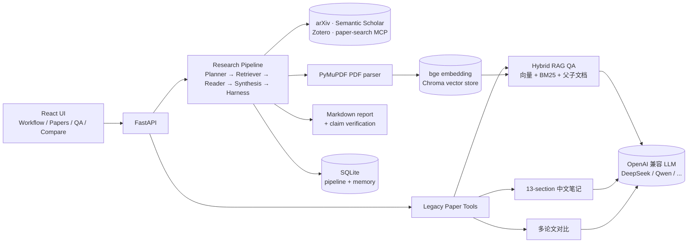

# ResearchAgent

[](QUICKSTART.md)
[](https://www.python.org/)
[](https://fastapi.tiangolo.com/)
[](LICENSE)

> 一句话：上传论文 PDF → 自动生成 13 段中文精读笔记 → 基于全文的 RAG 问答 → 多论文横向对比 → 一键导出 Markdown。也支持输入研究问题，自动检索 arXiv / Semantic Scholar / Zotero 并产出带引用校验的研究综述。

> 🌐 **在线 Demo**：_（部署中，敬请期待 —— 见 [产品化计划](docs/PRODUCTIZATION_PLAN.md)）_ · 💻 **自部署**：`git clone && docker compose up -d`（见 [快速启动](#快速启动docker--推荐)）

ResearchAgent 是一个面向科研阅读、选题调研和 related work 写作的本地优先研究助手。它现在有两条入口：

- **Research Pipeline**：用户输入研究问题，系统执行 Planner -> Retriever -> Reader -> Synthesis -> Harness，生成带引用和校验状态的 Markdown 研究报告。
- **Legacy Paper Tools**：保留原有 PDF 解析、论文笔记、RAG 问答、多论文对比、知识库和 Streamlit 调试入口。

项目的当前主线是 Research Pipeline MVP。旧 `/research-runs` 和 Streamlit 没有删除，它们仍可作为 legacy/debug 路径使用。

## 当前状态

Research Pipeline 的 6 个开发 slice 已完成：

| Slice | 内容 | 状态 |
|------|------|------|
| 1 | 后端骨架、SQLite store、stub runner、`/research-pipeline` 最小 API | 已完成 |
| 2 | Zotero / Semantic Scholar / arXiv 来源适配、PaperCandidate 归一化、Retriever | 已完成 |
| 3 | Planner、Reader、PaperCard、PDF 与 abstract-only fallback | 已完成 |
| 4 | Markdown report、ReportClaim、rule-first Harness、报告 API | 已完成 |
| 5 | React Workflow UI、New Run、Run Detail、轮询、Timeline、PaperCards、Harness Summary | 已完成 |
| 6 | Seed evaluation dataset、metrics、MVP gate report 脚本、回归验证 | 已完成 |

注意：`app/evaluation/reports/research_pipeline_mvp_gate.md` 当前是 **PENDING**。评估基础设施和测试已完成，但真实 MVP gate 需要先运行 3 个 seed research runs，再用生成的 run ids 计算。

## 核心能力

| 能力 | 说明 |
|------|------|
| Research Pipeline | 从研究问题到 Markdown 报告的端到端 workflow |
| Source Modes | 支持 `web_search`、`zotero_only`、`hybrid` 三种来源模式 |
| Planner | 生成 normalized question、queries、relevance criteria，并在候选集返回后选择 Reader 论文 |
| Retriever | 统一 Zotero、Semantic Scholar、arXiv 候选论文为 `PaperCandidate` |
| Reader | 对 PDF 或 abstract metadata 生成结构化 `PaperCard` |
| Synthesis | 生成固定结构的 Markdown research report |
| Harness | 给 report claims 标记 `supported`、`weak`、`unverified`、`numeric_trace_missing`、`conflict_detected` |
| React Workflow UI | 创建 run、查看进度、中间产物、PaperCards、Harness Summary 和报告预览 |
| Legacy Tools | PDF 上传解析、笔记生成、RAG QA、多论文对比、任务状态、知识库管理 |
| Evaluation Harness | 3 个 seed questions、gold annotations、自动指标和 MVP gate report 脚本 |

## 架构概览



```text
React Workflow UI
  -> FastAPI /research-pipeline
    -> SQLite research pipeline store
    -> Planner
    -> Retriever
       -> Zotero local API
       -> Semantic Scholar adapter
       -> arXiv adapter
    -> Reader
       -> PDF parser
       -> abstract-only fallback
    -> Synthesis
    -> Harness
    -> Markdown report + claim verification

Legacy Streamlit UI
  -> existing services in app/services, app/agents, app/research_workflow
```

关键边界：

- 新 pipeline 位于 `app/research_pipeline/`。
- 新 API 位于 `/research-pipeline`。
- 旧 Zotero knowledge-pack workflow 仍位于 `app/research_workflow/` 和 `/research-runs`。
- Streamlit 位于 `ui/streamlit_app.py`，继续保留。

## 快速启动（Docker — 推荐）

无需安装 Python，一行命令启动（[详细说明](QUICKSTART.md)）：

```bash
cp .env.example .env   # 编辑 .env 填入 LLM API Key
docker compose up -d
```

然后打开：
- **React 前端**：http://localhost
- **API 文档**：http://localhost:8000/docs

---

## 快速启动（本地开发）

### 1. 准备 Python 环境

```powershell
conda create -n research_agent python=3.11 -y
conda activate research_agent
pip install -r requirements.txt
```

### 2. 配置 `.env`

```powershell
Copy-Item .env.example .env
```

至少配置 LLM：

```env
LLM_PROVIDER=openai_compatible
LLM_BASE_URL=https://api.example.com/v1
LLM_API_KEY=your_api_key
LLM_MODEL=deepseek-chat
```

Zotero local API 默认使用：

```env
ZOTERO_LOCAL=true
ZOTERO_LIBRARY_ID=0
```

Semantic Scholar 和 arXiv 当前通过现有 adapter/MCP 路径接入。真实外部检索需要对应服务可用；测试默认使用 fake client，不依赖网络。

### 3. 启动 FastAPI

```powershell
uvicorn app.main:app --reload --port 8888
```

打开：

```text
http://127.0.0.1:8888/docs
```

### 4. 启动 React 前端

```powershell
cd frontend
npm install
npm run dev
```

打开：

```text
http://127.0.0.1:5173
```

主要页面：

- `/dashboard`：系统状态、模型、存储、MCP Hub
- `/workflow`：Research Pipeline run list
- `/workflow/new`：创建 research run
- `/workflow/:runId`：查看 timeline、events、candidates、PaperCards、Harness Summary 和 Markdown report

### 5. 启动 Legacy Streamlit

```powershell
streamlit run ui/streamlit_app.py
```

打开：

```text
http://localhost:8501
```

## Research Pipeline 使用流程

1. 打开 React 前端：`http://127.0.0.1:5173`
2. 进入 `/workflow/new`
3. 输入 research question
4. 选择 source mode：
   - `web_search`：Semantic Scholar + arXiv
   - `zotero_only`：本地 Zotero collection
   - `hybrid`：Zotero collection 作为 seed，再扩展 Web Search
5. 配置 `max_reader_papers`，默认 8，范围 3-15
6. 配置 `reader_concurrency`，默认 3
7. 创建 run
8. 在 run detail 页面查看：
   - Agent Timeline
   - Events
   - Candidate Papers
   - PaperCards
   - Harness Summary
   - Markdown Report Preview

失败和降级会显示在 stage 和 event 中。单篇论文 Reader 失败不会直接让整个 run 失败；全部 Reader 失败时才会让 run 失败。

## API

### Research Pipeline

| 方法 | 路径 | 说明 |
|------|------|------|
| `POST` | `/research-pipeline/runs` | 创建 research run |
| `GET` | `/research-pipeline/runs` | 列出 research runs |
| `GET` | `/research-pipeline/runs/{run_id}` | 查看 run detail |
| `POST` | `/research-pipeline/runs/{run_id}/cancel` | 取消 queued/running/degraded run |
| `GET` | `/research-pipeline/sources/zotero/collections` | 列出本地 Zotero collections |
| `GET` | `/research-pipeline/runs/{run_id}/report` | 获取报告、claims 和 verification summary |
| `GET` | `/research-pipeline/runs/{run_id}/report.md` | 下载 Markdown 报告 |

创建 run 示例：

```powershell
curl -X POST http://127.0.0.1:8888/research-pipeline/runs `
  -H "Content-Type: application/json" `
  -d '{
    "question": "What are reliable evaluation methods for retrieval augmented generation?",
    "source_mode": "hybrid",
    "zotero_collection_key": "YOUR_COLLECTION_KEY",
    "max_reader_papers": 8,
    "reader_concurrency": 3,
    "year_start": 2020,
    "year_end": 2026,
    "keywords": ["RAG", "evaluation", "faithfulness"]
  }'
```

### Legacy Paper APIs

| 方法 | 路径 | 说明 |
|------|------|------|
| `GET` | `/health` | 健康检查 |
| `GET` | `/system/status` | React dashboard runtime status |
| `GET` | `/papers` | 列出论文 |
| `POST` | `/papers/upload` | 上传并解析 PDF |
| `POST` | `/papers/{paper_id}/parse` | 重新解析 PDF |
| `POST` | `/papers/{paper_id}/note` | 生成论文笔记 |
| `GET` | `/papers/{paper_id}/note` | 读取论文笔记 |
| `GET` | `/papers/{paper_id}/download` | 下载论文笔记 |
| `POST` | `/papers/{paper_id}/index` | 建立向量索引 |
| `GET` | `/papers/{paper_id}/index-status` | 查看单篇索引状态 |
| `GET` | `/library/index-status` | 查看全库索引状态 |
| `POST` | `/qa` | RAG 问答 |
| `POST` | `/papers/compare` | 多论文对比 |
| `GET` | `/tasks` | 后台任务列表 |
| `POST` | `/tasks/note/{paper_id}` | 提交笔记生成任务 |
| `POST` | `/tasks/compare` | 提交多论文对比任务 |
| `GET` | `/research-runs` | Legacy Zotero knowledge-pack runs |

## Evaluation Harness

Seed dataset：

```text
app/evaluation/datasets/research_pipeline_seed.jsonl
```

MVP gate report：

```text
app/evaluation/reports/research_pipeline_mvp_gate.md
```

生成真实 MVP gate report：

```powershell
& "D:\Hcworkspace\Anoconda3\envs\research_agent\python.exe" -m app.research_pipeline.evaluation.run_mvp_gate `
  --db-path app/storage/metadata/research_pipeline.db `
  --seed-dataset app/evaluation/datasets/research_pipeline_seed.jsonl `
  --run-ids <run_id_1> <run_id_2> <run_id_3> `
  --output-md app/evaluation/reports/research_pipeline_mvp_gate.md
```

当前 `research_pipeline_mvp_gate.md` 说明评估基础设施已完成，但真实 gate 仍需实际 runs。

## 开发验证

推荐 Python 解释器：

```text
D:\Hcworkspace\Anoconda3\envs\research_agent\python.exe
```

后端 Research Pipeline 测试：

```powershell
& "D:\Hcworkspace\Anoconda3\envs\research_agent\python.exe" -m pytest tests/research_pipeline -q
```

关键回归：

```powershell
& "D:\Hcworkspace\Anoconda3\envs\research_agent\python.exe" -m pytest tests/research_pipeline tests/test_system_status_endpoint.py tests/test_research_run_router.py tests/test_research_workflow_ui_import.py -q
```

前端验证：

```powershell
cd frontend
npm test
npm run lint
npm run build
```

LLM 连通性检查：

```powershell
& "D:\Hcworkspace\Anoconda3\envs\research_agent\python.exe" scripts/check_llm.py
& "D:\Hcworkspace\Anoconda3\envs\research_agent\python.exe" scripts/check_llm.py --deep
```

## 项目结构

```text
ResearchAgent/
  app/
    main.py
    config.py
    schemas.py
    research_pipeline/
      router.py
      service.py
      store.py
      runner.py
      events.py
      schemas.py
      agents/
      sources/
      evaluation/
    research_workflow/
    services/
    agents/
    evaluation/
      datasets/
      reports/
  frontend/
    src/
      api/
      app/
      components/
      pages/
        workflow/
  ui/
    streamlit_app.py
  docs/
    superpowers/
      specs/
      plans/
  tests/
    research_pipeline/
```

## 关键文档

- PRD：`docs/superpowers/specs/2026-06-21-research-pipeline-mvp-prd.md`
- 技术方案：`docs/superpowers/specs/2026-06-21-research-pipeline-mvp-technical-design.md`
- 任务拆解：`docs/superpowers/plans/2026-06-21-research-pipeline-mvp-task-breakdown.md`
- React 设计：`docs/superpowers/specs/2026-06-18-react-frontend-replacement-design.md`
- 架构文档：`docs/ARCHITECTURE.md`
- API 参考：`docs/API_REFERENCE.md`
- 运行指南：`docs/RUN_GUIDE.md`

## 维护边界

- 不删除 Streamlit。它仍是 legacy/debug 入口。
- 不删除 `/research-runs`。它仍是旧 Zotero knowledge-pack workflow。
- 新开发优先落在 `app/research_pipeline/` 和 React `/workflow` 页面。
- README 中的效果指标只写已验证事实。真实 MVP gate 结果以 `research_pipeline_mvp_gate.md` 和实际 run ids 为准。
