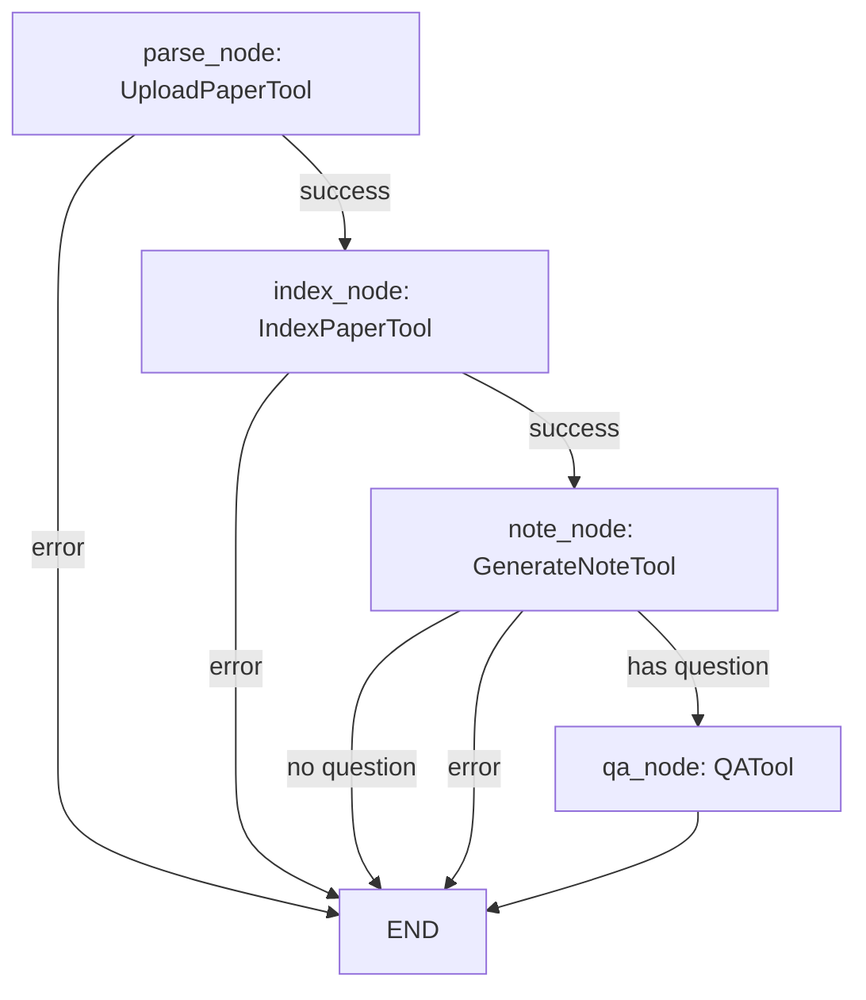

# ARCHITECTURE.md — ResearchAgent

## 系统架构

```
┌──────────────────────────────────────────────────────┐
│                  Streamlit UI                         │
│  ┌──────────┬──────────┬──────────┬────────────────┐ │
│  │ 上传     │ 笔记     │ 问答     │ 对比 / 知识库   │ │
│  └────┬─────┴────┬─────┴────┬─────┴───────┬────────┘ │
│       │          │          │             │          │
│  ┌────▼──────────▼──────────▼─────────────▼────────┐ │
│  │              Service Layer                       │ │
│  │  pdf_parser / note_generator / paper_qa         │ │
│  │  paper_compare / chunker / markdown_exporter    │ │
│  └────┬──────────┬──────────┬─────────────────────┘ │
│       │          │          │                       │
│  ┌────▼────┐ ┌───▼────┐ ┌───▼──────────┐           │
│  │ LLM     │ │ Embed  │ │ Vector Store  │           │
│  │ Client  │ │ Client │ │ (cosine sim)  │           │
│  └────┬────┘ └───┬────┘ └───────────────┘           │
│       │          │                                   │
│  ┌────▼──────────▼──────────────────────────────┐   │
│  │           External / Local                     │   │
│  │  OpenAI API  │  SentenceTransformers           │   │
│  └────────────────────────────────────────────────┘  │
│                                                      │
│  ┌────────────────────────────────────────────────┐  │
│  │           Storage Layer                         │  │
│  │  papers/  │ notes/  │ metadata/  │ vector_db/  │  │
│  └────────────────────────────────────────────────┘  │
└──────────────────────────────────────────────────────┘
```

## PDF → Markdown 主链路

```
PDF file
  ↓ POST /papers/upload (or streamlit file_uploader)
pdf_parser.parse_pdf()
  ├─ fitz.open() → page.get_text()
  ├─ _detect_title() → 字体大小检测
  ├─ _extract_abstract() → 正则匹配
  └─ _extract_sections() → 关键词切分
  ↓ save_parse_result()
app/storage/metadata/{paper_id}_parsed.json
  ↓
note_generator.generate_note()
  ├─ load_parsed_result()
  ├─ _build_paper_content() → 截断策略 (8000 chars)
  ├─ build_note_prompt() → 13 段模板
  └─ llm_client.generate_text() → LLM 返回 Markdown
  ↓ save_markdown()
app/storage/notes/{paper_id}_note.md
  ↓ GET /papers/{id}/download
user downloads .md
```

## RAG 问答流程

```
Question
  ↓ POST /qa {question, paper_id?, top_k}
embedding_client.embed_query(question)
  ↓ query_embedding (768-dim)
vector_store.query(query_embedding, top_k, paper_id)
  ├─ 余弦相似度排序
  └─ 返回 top_k chunks (content + metadata)
  ↓
_build_context() → "[片段 N] Paper:... Section:...\ncontent"
  ↓
build_qa_prompt(question, context)
  ↓ strict prompt (不编造/不足声明/列依据)
llm_client.generate_text(prompt)
  ↓
{question, answer, sources: [...chunk metadata...]}
```

## 多论文对比流程

```
2-5 paper_ids
  ↓ POST /papers/compare
load_parsed_result() × N
  ↓ 每篇: 摘要 + sections
_build_paper_summary() × N
  ↓ Markdown 结构化汇总
build_compare_prompt()
  ↓ 9 维度表格 + 不夸大 + "未明确说明"
LLM → 对比 Markdown 表格
  ↓ save_compare_result()
notes/compare_{timestamp}.md
```

## 模块依赖关系

```
schemas.py          ← 所有数据模型
config.py           ← pydantic-settings, .env
prompts/            ← 纯文本模板，无依赖
services/
  pdf_parser.py     → schemas, config
  llm_client.py     → config
  embedding_client  → config
  vector_store.py   → schemas, config
  chunker.py        → schemas
  note_generator    → pdf_parser, llm_client, prompts
  paper_qa.py       → vector_store, embedding_client, llm_client, prompts
  paper_compare.py   → pdf_parser, llm_client, prompts
  markdown_exporter → (独立)
main.py             → 汇总所有 services
ui/streamlit_app.py → 调用 service 层 (不经过 HTTP)
```

## 后续 Agent 化扩展方式

当前各 service 模块设计为独立可组合函数，后续 Agent 化只需：

```python
# 工具注册 (app/agents/tools.py)
tools = {
    "parse_paper": parse_pdf,
    "generate_note": generate_note,
    "index_paper": chunk_paper + vector_store.add_chunks,
    "qa_paper": answer_question,
    "compare_papers": compare_papers,
    "export_markdown": save_markdown,
}

# Agent 执行流程
# 用户输入 → LLM 规划工具调用 → 依次执行 → 汇总结果
```

- 无需改动现有 service 层
- 工具签名已统一（输入明确、返回标准化）
- VectorStore / EmbeddingClient 已通过 `@st.cache_resource` 支持单例

## Agent 架构（Phase 1）

```
┌─────────────────────────────────────────────────────────────┐
│                    Agent System Layer                        │
│                                                              │
│  ┌─────────────────┐  ┌──────────────────────────────────┐  │
│  │ PaperResearchAgent│  │ LangGraph Workflows              │  │
│  │ (langchain       │  │                                  │  │
│  │  create_agent)   │  │  research_workflow:              │  │
│  │                  │  │   parse → index → note → qa      │  │
│  │  - 6 tools       │  │                                  │  │
│  │  - multi-turn    │  │  comparison_workflow:            │  │
│  │  - streaming     │  │   parse_papers → compare → export │  │
│  └────────┬─────────┘  └──────────────┬───────────────────┘  │
│           │                           │                      │
│  ┌────────▼───────────────────────────▼───────────────────┐  │
│  │              LangChain Adapter Layer                    │  │
│  │  BaseTool → StructuredTool conversion                  │  │
│  │  Dynamic Pydantic args_schema generation               │  │
│  └────────┬───────────────────────────────────────────────┘  │
│           │                                                  │
│  ┌────────▼───────────────────────────────────────────────┐  │
│  │              Tool Wrapper Layer                         │  │
│  │  BaseTool / ToolRegistry / 6 Paper Tools               │  │
│  │  upload_paper | generate_note | index_paper | qa       │  │
│  │  compare_papers | export_markdown                      │  │
│  └─────────────────────────────────────────────────────────┘  │
│                                                              │
│  API: POST /agent/execute  │  UI: 🤖 Agent 助手 Tab         │
└─────────────────────────────────────────────────────────────┘
```

### Agent 工作流（Mermaid）



### 关键设计决策

- **Adapter 模式**: BaseTool → LangChain StructuredTool，通过 Pydantic 动态生成 args_schema
- **Agent 引擎**: 使用 `langchain.agents.create_agent`（最新 API），基于 LangGraph StateGraph
- **工作流编排**: TypedDict state + conditional edges 实现错误短路和条件路由
- **对话历史**: list[dict] → LangChain HumanMessage/AIMessage 转换
