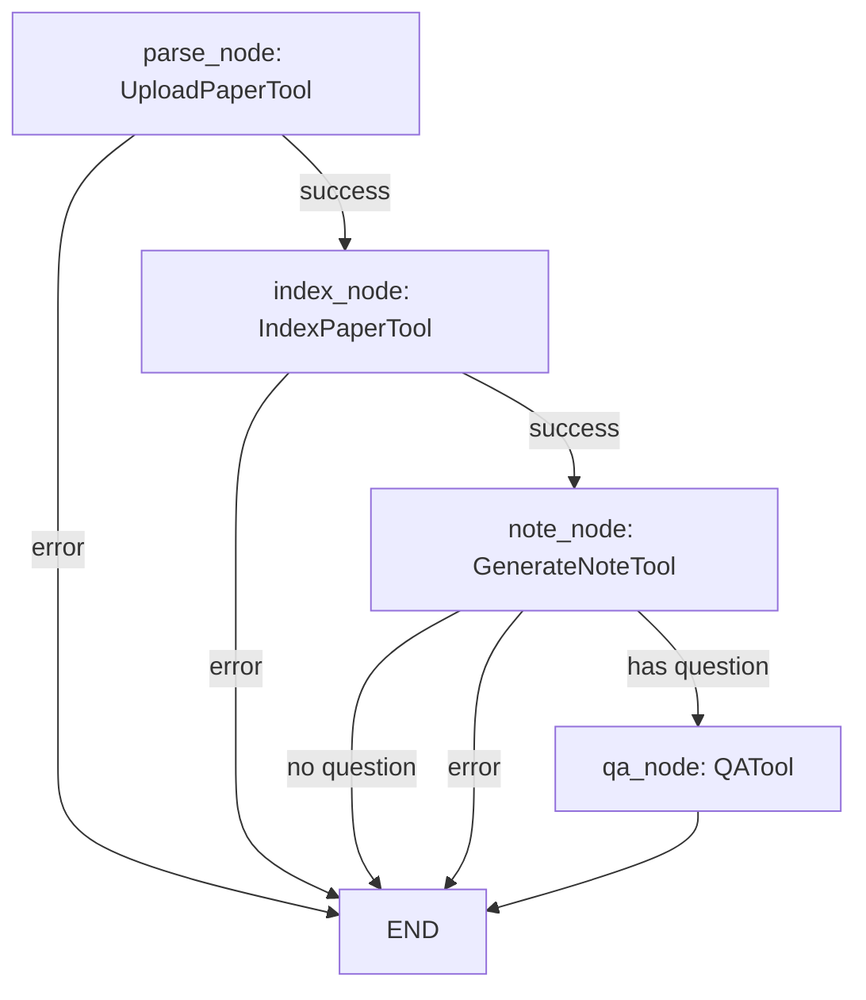

# ARCHITECTURE.md — ResearchAgent

## 系统架构

```
┌──────────────────────────────────────────────────────┐
│                  Streamlit UI                         │
│  ┌──────────┬──────────┬──────────┬────────────────┐ │
│  │ 上传     │ 笔记     │ 问答     │ 对比 / 知识库   │ │
│  └────┬─────┴────┬─────┴────┬─────┴───────┬────────┘ │
│       │          │          │             │          │
│  ┌────▼──────────▼──────────▼─────────────▼────────┐ │
│  │              Service Layer                       │ │
│  │  pdf_parser / note_generator / paper_qa         │ │
│  │  paper_compare / chunker / markdown_exporter    │ │
│  └────┬──────────┬──────────┬─────────────────────┘ │
│       │          │          │                       │
│  ┌────▼────┐ ┌───▼────┐ ┌───▼──────────┐           │
│  │ LLM     │ │ Embed  │ │ Vector Store  │           │
│  │ Client  │ │ Client │ │ (cosine sim)  │           │
│  └────┬────┘ └───┬────┘ └───────────────┘           │
│       │          │                                   │
│  ┌────▼──────────▼──────────────────────────────┐   │
│  │           External / Local                     │   │
│  │  OpenAI API  │  SentenceTransformers           │   │
│  └────────────────────────────────────────────────┘  │
│                                                      │
│  ┌────────────────────────────────────────────────┐  │
│  │           Storage Layer                         │  │
│  │  papers/  │ notes/  │ metadata/  │ vector_db/  │  │
│  └────────────────────────────────────────────────┘  │
└──────────────────────────────────────────────────────┘
```

## PDF → Markdown 主链路

```
PDF file
  ↓ POST /papers/upload (or streamlit file_uploader)
pdf_parser.parse_pdf()
  ├─ fitz.open() → page.get_text()
  ├─ _detect_title() → 字体大小检测
  ├─ _extract_abstract() → 正则匹配
  └─ _extract_sections() → 关键词切分
  ↓ save_parse_result()
app/storage/metadata/{paper_id}_parsed.json
  ↓
note_generator.generate_note()
  ├─ load_parsed_result()
  ├─ _build_paper_content() → 截断策略 (8000 chars)
  ├─ build_note_prompt() → 13 段模板
  └─ llm_client.generate_text() → LLM 返回 Markdown
  ↓ save_markdown()
app/storage/notes/{paper_id}_note.md
  ↓ GET /papers/{id}/download
user downloads .md
```

## RAG 问答流程

```
Question
  ↓ POST /qa {question, paper_id?, top_k}
embedding_client.embed_query(question)
  ↓ query_embedding (768-dim)
vector_store.query(query_embedding, top_k, paper_id)
  ├─ 余弦相似度排序
  └─ 返回 top_k chunks (content + metadata)
  ↓
_build_context() → "[片段 N] Paper:... Section:...\ncontent"
  ↓
build_qa_prompt(question, context)
  ↓ strict prompt (不编造/不足声明/列依据)
llm_client.generate_text(prompt)
  ↓
{question, answer, sources: [...chunk metadata...]}
```

## 多论文对比流程

```
2-5 paper_ids
  ↓ POST /papers/compare
load_parsed_result() × N
  ↓ 每篇: 摘要 + sections
_build_paper_summary() × N
  ↓ Markdown 结构化汇总
build_compare_prompt()
  ↓ 9 维度表格 + 不夸大 + "未明确说明"
LLM → 对比 Markdown 表格
  ↓ save_compare_result()
notes/compare_{timestamp}.md
```

## 模块依赖关系

```
schemas.py          ← 所有数据模型
config.py           ← pydantic-settings, .env
prompts/            ← 纯文本模板，无依赖
services/
  pdf_parser.py     → schemas, config
  llm_client.py     → config
  embedding_client  → config
  vector_store.py   → schemas, config
  chunker.py        → schemas
  note_generator    → pdf_parser, llm_client, prompts
  paper_qa.py       → vector_store, embedding_client, llm_client, prompts
  paper_compare.py   → pdf_parser, llm_client, prompts
  markdown_exporter → (独立)
main.py             → 汇总所有 services
ui/streamlit_app.py → 调用 service 层 (不经过 HTTP)
```

## 后续 Agent 化扩展方式

当前各 service 模块设计为独立可组合函数，后续 Agent 化只需：

```python
# 工具注册 (app/agents/tools.py)
tools = {
    "parse_paper": parse_pdf,
    "generate_note": generate_note,
    "index_paper": chunk_paper + vector_store.add_chunks,
    "qa_paper": answer_question,
    "compare_papers": compare_papers,
    "export_markdown": save_markdown,
}

# Agent 执行流程
# 用户输入 → LLM 规划工具调用 → 依次执行 → 汇总结果
```

- 无需改动现有 service 层
- 工具签名已统一（输入明确、返回标准化）
- VectorStore / EmbeddingClient 已通过 `@st.cache_resource` 支持单例

## Agent 架构（Phase 1）

```
┌─────────────────────────────────────────────────────────────┐
│                    Agent System Layer                        │
│                                                              │
│  ┌─────────────────┐  ┌──────────────────────────────────┐  │
│  │ PaperResearchAgent│  │ LangGraph Workflows              │  │
│  │ (langchain       │  │                                  │  │
│  │  create_agent)   │  │  research_workflow:              │  │
│  │                  │  │   parse → index → note → qa      │  │
│  │  - 6 tools       │  │                                  │  │
│  │  - multi-turn    │  │  comparison_workflow:            │  │
│  │  - streaming     │  │   parse_papers → compare → export │  │
│  └────────┬─────────┘  └──────────────┬───────────────────┘  │
│           │                           │                      │
│  ┌────────▼───────────────────────────▼───────────────────┐  │
│  │              LangChain Adapter Layer                    │  │
│  │  BaseTool → StructuredTool conversion                  │  │
│  │  Dynamic Pydantic args_schema generation               │  │
│  └────────┬───────────────────────────────────────────────┘  │
│           │                                                  │
│  ┌────────▼───────────────────────────────────────────────┐  │
│  │              Tool Wrapper Layer                         │  │
│  │  BaseTool / ToolRegistry / 6 Paper Tools               │  │
│  │  upload_paper | generate_note | index_paper | qa       │  │
│  │  compare_papers | export_markdown                      │  │
│  └─────────────────────────────────────────────────────────┘  │
│                                                              │
│  API: POST /agent/execute  │  UI: 🤖 Agent 助手 Tab         │
└─────────────────────────────────────────────────────────────┘
```

### Agent 工作流（Mermaid）



### 关键设计决策

- **Adapter 模式**: BaseTool → LangChain StructuredTool，通过 Pydantic 动态生成 args_schema
- **Agent 引擎**: 使用 `langchain.agents.create_agent`（最新 API），基于 LangGraph StateGraph
- **工作流编排**: TypedDict state + conditional edges 实现错误短路和条件路由
- **对话历史**: list[dict] → LangChain HumanMessage/AIMessage 转换

## Analytics & Experiments（Phase 2）

```
Service Layer (instrumented)              Analytics Layer
─────────────────────────────              ──────────────────
paper_qa.answer_question  ──────────►  _emit_qa_event ──┐
paper_compare.compare_papers ───────►  _emit_compare ───┤
note_generator.generate_note ───────►  _emit_note ──────┤
                                                          ▼
                                              AnalyticsCollector (JSONL)
                                                  │            │
                                                  ▼            ▼
                                 events.jsonl       failures.jsonl
                                       │                  │
                                       ▼                  ▼
                            analyze_retrieval        failure_analyzer
                            analyze_qa               failure_detector
                            analyze_comparison              │
                                       │                    │
                                       ▼                    ▼
                                visualizer (matplotlib + seaborn)
                                       │
                                       ▼
                            Jupyter notebooks (4)

ExperimentRunner
   │
   ├─ load scenarios/<exp>.json (ExperimentConfig)
   ├─ run two variants via variant_fn
   ├─ compare_variants() → t-test on synthesized samples
   └─ generate_report() → MD + JSON in experiments/reports/
```

### 关键设计决策

- **Best-effort emit**: 服务层埋点失败仅 debug log，永不破坏主流程
- **JSONL 文件持久化**: 沿用 `FileJobStore` 模式，Phase 3 才引入数据库
- **Pluggable variant_fn**: 内置 `default_simulated_executor` 用于框架测试，真实执行器在使用方注入
- **Reuse 评估算法**: `analyze_*.py` 不重复实现指标，直接复用 `app/evaluation/metrics.py` 和 `judges.py`

## Production Readiness（Phase 3）

```
FastAPI API
  │
  ├─ RequestIDMiddleware
  │    └─ X-Request-ID + api_request JSONL log
  │
  ├─ Error handlers
  │    ├─ HTTPException → ErrorResponse(http_error)
  │    └─ Exception → ErrorResponse(internal_server_error)
  │
  ├─ Background task endpoints
  │    ├─ POST /tasks/note/{paper_id}
  │    ├─ POST /tasks/compare
  │    ├─ GET /tasks/{job_id}
  │    ├─ GET /tasks/{job_id}/result
  │    ├─ DELETE /tasks/{job_id}
  │    └─ POST /tasks/{job_id}/retry
  │
  └─ JobStore
       ├─ InMemoryJobStore
       └─ FileJobStore (JSON persistence)
```

### 任务系统设计

- `JobStatusResponse` 是通用任务状态模型，支持 `paper_index`、`note_generation`、`paper_comparison`、`batch_index`
- `IndexStatusResponse` 继承通用模型并保留索引指标字段，保证旧 `/jobs` 接口兼容
- 任务状态统一为 `queued` / `running` / `completed` / `failed` / `cancelled`
- `result` 只保存轻量摘要和输出路径，完整产物仍写入 notes/vector store 等既有存储

### 日志与排查

- `app/logging_config.py` 输出 JSONL 日志
- `app/middleware/tracing.py` 为所有响应添加 `X-Request-ID`
- `app/analytics/log_analyzer.py` 从 JSONL 统计接口调用次数、错误率、P50/P95 延迟和服务事件
- 错误响应包含 `request_id`，便于从用户反馈定位服务端日志

### 工程化取舍

- Phase 3 不引入 Celery/Redis：当前单用户本地 MVP 使用 `BackgroundTasks` 足够
- Phase 3 不引入数据库：继续保留文件产物可读性，待 Agent memory / 多用户需求明确后再评估

## 高级 RAG（Phase 4）

Phase 4 在 baseline `vector_store.query → LLM` 之上引入了可配置的检索 / 精排 / 查询优化链路，所有阶段通过 `app/config.py` 切换：

```
                ┌──────────────────────────────────────────┐
question ──►    │   (可选) QueryRewriter / HyDE            │
                └────────────────┬─────────────────────────┘
                                 ▼
                ┌──────────────────────────────────────────┐
                │   Retriever                              │
                │   ├─ vector   (VectorStore.query)        │
                │   ├─ bm25     (BM25Retriever, jieba)     │
                │   └─ hybrid   (α·dense + (1-α)·sparse)   │
                └────────────────┬─────────────────────────┘
                                 ▼
                ┌──────────────────────────────────────────┐
                │   (可选) CrossEncoderReranker            │
                │     bge-reranker-v2-m3                   │
                │     召回 top_k=20 → 精排 top_k=5         │
                └────────────────┬─────────────────────────┘
                                 ▼
                       build_qa_prompt → LLM
```

### 关键模块

| 模块 | 路径 | 职责 |
|---|---|---|
| `CrossEncoderReranker` | `app/services/reranker.py` | Cross-encoder 精排，懒加载 |
| `BM25Retriever` | `app/services/bm25_retriever.py` | rank-bm25 + jieba 中文分词 |
| `HybridRetriever` | `app/services/hybrid_retriever.py` | min-max 归一化 + α 融合 |
| `QueryRewriter` | `app/services/query_rewriter.py` | LLM 改写查询，失败回退 |
| `HyDE` | `app/services/hyde.py` | 生成假设论文段落 → embed → 检索 |
| `IncrementalIndexer` | `app/services/incremental_indexer.py` | sha1 hash diff 后只嵌入变更 chunks |
| `IndexVersionStore` | `app/services/index_version.py` | JSON 版本元数据 + 回滚 |
| `KnowledgeBaseManager` | `app/services/knowledge_base_manager.py` | 多 KB 隔离（JSON registry） |

### 注入点与单例

- `app/services/paper_qa.py::answer_question(retriever=..., reranker=..., recall_top_k=...)` 同时支持向后兼容（不传则走 `vector_store.query`）
- `app/main.py::_get_retriever()` / `_get_reranker()` 按 settings 切换，模型只加载一次
- `app/agents/tools/paper_tools.py::QATool` 通过 `_shared_cross_encoder_reranker(model_name)` 共用 reranker 缓存

### KB 管理 API

`GET /kb`、`POST /kb`、`POST /kb/{kb_id}/papers`、`DELETE /kb/{kb_id}/papers/{paper_id}`

### Phase 4 取舍

- 不引入 Chroma 多 collection；KB 通过 paper_id 列表关联，复用单一 vector store
- 索引版本管理与 `KnowledgeBaseManager` 解耦，便于按需采用

## 多 Agent 协作（Phase 5）

Phase 5 在 Phase 1 的单 Agent ReAct 基础上引入 Supervisor 多 Agent 架构：

```
┌─────────────────────────────────────────────────────────────┐
│                  Multi-Agent Layer                           │
│                                                             │
│  ┌───────────────────────────────────────────────────────┐  │
│  │  Supervisor (LangGraph StateGraph)                    │  │
│  │  route_node → execute_node → synthesize_node → END   │  │
│  └────────────────────────┬──────────────────────────────┘  │
│                           │                                 │
│  ┌────────────────────────▼──────────────────────────────┐  │
│  │  Specialist Agents                                    │  │
│  │  ┌──────────┬───────────┬──────────┬──────────────┐   │  │
│  │  │Extractor │Summarizer │ QA Agent │ Comparator   │   │  │
│  │  └──────────┴───────────┴──────────┴──────────────┘   │  │
│  └───────────────────────────────────────────────────────┘  │
│                                                             │
│  ┌───────────────────────────────────────────────────────┐  │
│  │  Memory System (SQLite WAL)                           │  │
│  │  ShortTerm │ LongTerm │ Semantic                      │  │
│  └───────────────────────────────────────────────────────┘  │
│                                                             │
│  ┌───────────────────────────────────────────────────────┐  │
│  │  Observability                                        │  │
│  │  AgentTracer │ DecisionLogger │ /api/traces           │  │
│  └───────────────────────────────────────────────────────┘  │
│                                                             │
│  API: POST /agent/execute {mode: "supervisor"}              │
│  UI: 🔍 Agent 监控 Tab                                     │
└─────────────────────────────────────────────────────────────┘
```

### 协作场景

| 场景 | Graph | 节点 |
|------|-------|------|
| 完整论文分析 | PaperAnalysisState | extract → summarize → qa |
| 多论文对比 | ComparisonState | batch_extract → compare |
| 交互式研究 | Sequential supervisor | 多轮路由 |

### Phase 5 取舍

- 使用 LangGraph 而非 AutoGen/CrewAI：与现有 LangChain 生态一致，无新依赖
- SQLite 而非 Redis/PostgreSQL：单用户本地 MVP 足够，WAL 模式支持并发读
- 关键词意图分类而非 LLM 分类：零延迟、零成本、可解释
