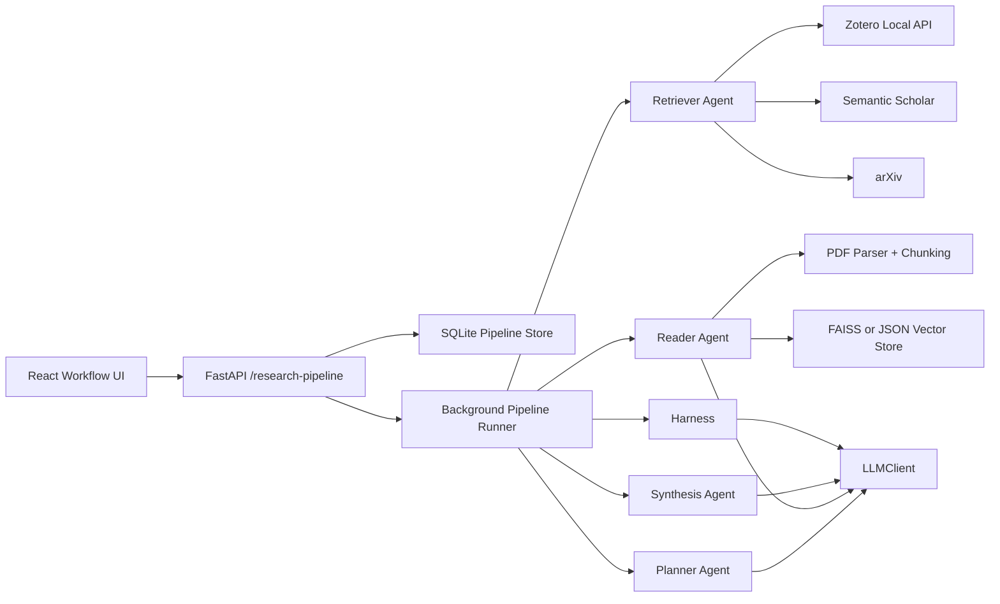

# ResearchAgent Research Pipeline MVP 技术方案

Date: 2026-06-21
Status: Draft for implementation planning
Owner: HC + Codex
Related PRD: `docs/superpowers/specs/2026-06-21-research-pipeline-mvp-prd.md`
Related frontend design: `docs/superpowers/specs/2026-06-18-react-frontend-replacement-design.md`

## 1. 技术目标

本方案把 PRD 中的 Agent Workflow MVP 落到可实现的工程结构上。目标不是重写 ResearchAgent，而是在现有 FastAPI、React、Zotero、PDF 解析、embedding、vector store 和 evaluation 基础上新增一条独立的 `research_pipeline` 路径。

MVP 要交付一条可追踪的异步 research run：

1. 用户在 React 中创建研究任务。
2. 后端保存 run、stage、event 和中间产物。
3. Planner 生成查询计划。
4. Retriever 从 Web Search、Zotero 或 Hybrid 模式生成候选论文。
5. Reader 将入选论文转成 `PaperCard`。
6. Synthesis 生成带 citation id 的 Markdown 报告。
7. Harness 给关键 claim 标记校验状态。
8. 前端轮询并展示进度、中间产物、最终报告和低置信结果。

## 2. 现有代码锚点

本方案基于当前仓库已存在的这些能力：

- FastAPI 入口：`app/main.py`
- 旧 research workflow 路由：`app/routers/research_runs.py`
- 旧 Zotero knowledge-pack workflow：`app/research_workflow/`
- Zotero local API 客户端：`app/research_workflow/zotero_intake.py`
- Semantic Scholar MCP adapter：`app/research_workflow/semantic_scholar_mcp_adapter.py`
- arXiv MCP adapter：`app/research_workflow/arxiv_mcp_adapter.py`
- PDF 解析：`app/services/pdf_parser.py`
- embedding client：`app/services/embedding_client.py`
- JSON cosine vector store：`app/services/vector_store.py`
- LLM client：`app/services/llm_client.py`
- React API client：`frontend/src/api/client.ts`
- React route shell：`frontend/src/app/router.tsx`
- React Workflow 占位页：`frontend/src/pages/workflow/WorkflowPage.tsx`

关键结论：

- 现有 `/research-runs` 是旧 Zotero collection 到 Knowledge Pack 的 workflow，不应被强行改造成新 PRD 的 pipeline。
- 新 MVP 应新增 `/research-pipeline` API 和 `app/research_pipeline/` 包，保留旧 workflow 作为 legacy/debug 入口。
- 现有 `VectorStore` 实际是 JSON cosine store，虽然配置名里还有 `chroma`，但它可以作为 FAISS 阻塞时的 MVP 回退。
- 现有 React shell 已有 dashboard 和 workflow 路由，适合继续扩展，不需要重新搭前端项目。

## 3. 总体架构



设计原则：

- 新旧隔离：`app/research_pipeline/` 不直接复用旧 `ResearchRun` schema，以免旧 `/research-runs` 行为被破坏。
- 能力复用：外部来源、PDF、embedding、LLM、JSON vector fallback 复用已有模块。
- 状态优先：run、stage、event、candidate、PaperCard、report、claim verification 都先落 SQLite。
- 失败可见：单篇论文失败只影响对应 `PaperCard`，不让整个 run 直接失败。
- 降级明确：PDF 不可用时生成 `abstract_only` PaperCard；FAISS 不可用时切到 JSON cosine store；外部 API 不可用时保留已有来源结果。

## 4. 后端模块设计

新增包：

```text
app/research_pipeline/
  __init__.py
  schemas.py
  store.py
  router.py
  service.py
  runner.py
  events.py
  agents/
    __init__.py
    planner.py
    retriever.py
    reader.py
    synthesis.py
    harness.py
  sources/
    __init__.py
    semantic_scholar.py
    arxiv.py
    zotero.py
    normalizer.py
  indexing/
    __init__.py
    vector_index.py
    faiss_store.py
    json_store_adapter.py
  evaluation/
    __init__.py
    seed_loader.py
    metrics.py
```

职责边界：

- `schemas.py`：Pydantic request/response 和内部 DTO。
- `store.py`：SQLite schema 初始化、CRUD、事务边界。
- `router.py`：FastAPI endpoint，只做参数校验和 service 调用。
- `service.py`：创建 run、读取 run detail、取消 run、组装前端响应。
- `runner.py`：后台执行器，串联 Planner、Retriever、Reader、Synthesis、Harness。
- `events.py`：统一写入 stage/event 的 helper。
- `agents/`：各阶段业务逻辑，优先 schema 输出。
- `sources/`：外部来源适配和字段归一化。
- `indexing/`：FAISS 优先，JSON store fallback。
- `evaluation/`：seed case、自动指标和 MVP gate 报告。

## 5. API 设计

新增 router：`app/routers/research_pipeline.py` 或直接 `app/research_pipeline/router.py`，在 `app/main.py` 中 include。

推荐路径统一使用 `/research-pipeline`，避免和旧 `/research-runs` 混淆。

### 5.1 Create Run

`POST /research-pipeline/runs`

请求：

```json
{
  "question": "What are the latest methods for retrieval augmented generation evaluation?",
  "source_mode": "hybrid",
  "zotero_collection_key": "WY47EPBS",
  "max_reader_papers": 8,
  "reader_concurrency": 3,
  "year_start": 2020,
  "year_end": 2026,
  "venue_filter": ["ACL", "EMNLP", "NeurIPS"],
  "keywords": ["RAG evaluation", "faithfulness"]
}
```

响应：

```json
{
  "run_id": "rp_20260621_153000_ab12cd34",
  "status": "queued",
  "created_at": "2026-06-21T15:30:00Z"
}
```

### 5.2 List Runs

`GET /research-pipeline/runs?limit=20`

返回 run list，用于 Dashboard 和 Workflow 首页。

### 5.3 Get Run Detail

`GET /research-pipeline/runs/{run_id}`

返回：

- run header
- stage summary
- recent events
- planner output
- candidate papers
- reader progress
- PaperCards
- harness summary
- report metadata

### 5.4 Get Report

`GET /research-pipeline/runs/{run_id}/report`

返回 Markdown 内容、claim 列表和 verification summary。

### 5.5 Download Report

`GET /research-pipeline/runs/{run_id}/report.md`

返回 `text/markdown` 文件响应。

### 5.6 Cancel Run

`POST /research-pipeline/runs/{run_id}/cancel`

V1 只保证 queued/running 状态可以标记为 cancelled；已经进入单个 LLM/API 调用的阶段不强制中断底层请求。

### 5.7 Zotero Collections

`GET /research-pipeline/zotero/collections?limit=100`

复用 `ZoteroLocalHttpClient.list_collections()`，供 New Run 页面选择 collection。失败时返回明确错误，前端保留手动 key 输入。

## 6. SQLite 数据模型

SQLite 文件建议放在 `app/storage/metadata/research_pipeline.sqlite3`。这个路径跟现有 `settings.metadata_dir` 保持一致，便于备份和本地调试。

### 6.1 research_runs

```sql
CREATE TABLE IF NOT EXISTS research_runs (
  id TEXT PRIMARY KEY,
  question TEXT NOT NULL,
  normalized_question TEXT,
  source_mode TEXT NOT NULL,
  zotero_collection_key TEXT,
  status TEXT NOT NULL,
  max_reader_papers INTEGER NOT NULL,
  reader_concurrency INTEGER NOT NULL,
  year_start INTEGER,
  year_end INTEGER,
  venue_filter_json TEXT NOT NULL DEFAULT '[]',
  keywords_json TEXT NOT NULL DEFAULT '[]',
  created_at TEXT NOT NULL,
  started_at TEXT,
  completed_at TEXT,
  failed_at TEXT,
  cancelled_at TEXT,
  error TEXT
);
```

`status` 取值：`queued`、`running`、`completed`、`failed`、`cancelled`、`degraded`。

### 6.2 research_run_stages

```sql
CREATE TABLE IF NOT EXISTS research_run_stages (
  id TEXT PRIMARY KEY,
  run_id TEXT NOT NULL,
  stage TEXT NOT NULL,
  status TEXT NOT NULL,
  progress REAL NOT NULL DEFAULT 0,
  message TEXT NOT NULL DEFAULT '',
  started_at TEXT,
  completed_at TEXT,
  error TEXT,
  FOREIGN KEY(run_id) REFERENCES research_runs(id)
);
```

`stage` 固定为：`planner`、`retriever`、`reader`、`synthesis`、`harness`。

### 6.3 research_run_events

```sql
CREATE TABLE IF NOT EXISTS research_run_events (
  id TEXT PRIMARY KEY,
  run_id TEXT NOT NULL,
  stage TEXT NOT NULL,
  level TEXT NOT NULL,
  message TEXT NOT NULL,
  payload_json TEXT NOT NULL DEFAULT '{}',
  created_at TEXT NOT NULL,
  FOREIGN KEY(run_id) REFERENCES research_runs(id)
);
```

事件用于前端展示“发生了什么”，不要只把错误藏在日志里。

### 6.4 research_plans

```sql
CREATE TABLE IF NOT EXISTS research_plans (
  id TEXT PRIMARY KEY,
  run_id TEXT NOT NULL,
  version INTEGER NOT NULL,
  phase TEXT NOT NULL,
  plan_json TEXT NOT NULL,
  created_at TEXT NOT NULL,
  FOREIGN KEY(run_id) REFERENCES research_runs(id)
);
```

`phase` 取值：`initial`、`candidate_selection`。

### 6.5 paper_candidates

```sql
CREATE TABLE IF NOT EXISTS paper_candidates (
  id TEXT PRIMARY KEY,
  run_id TEXT NOT NULL,
  paper_id TEXT NOT NULL,
  source TEXT NOT NULL,
  title TEXT NOT NULL,
  authors_json TEXT NOT NULL DEFAULT '[]',
  year INTEGER,
  venue TEXT,
  abstract TEXT,
  doi TEXT,
  arxiv_id TEXT,
  semantic_scholar_id TEXT,
  zotero_item_id TEXT,
  url TEXT,
  pdf_url TEXT,
  local_pdf_path TEXT,
  citation_count INTEGER,
  relevance_score REAL,
  selected_for_reader INTEGER NOT NULL DEFAULT 0,
  metadata_json TEXT NOT NULL DEFAULT '{}',
  created_at TEXT NOT NULL,
  UNIQUE(run_id, paper_id),
  FOREIGN KEY(run_id) REFERENCES research_runs(id)
);
```

### 6.6 paper_cards

```sql
CREATE TABLE IF NOT EXISTS paper_cards (
  id TEXT PRIMARY KEY,
  run_id TEXT NOT NULL,
  paper_id TEXT NOT NULL,
  candidate_id TEXT NOT NULL,
  status TEXT NOT NULL,
  extraction_mode TEXT NOT NULL,
  title TEXT NOT NULL,
  bibliographic_json TEXT NOT NULL DEFAULT '{}',
  research_problem TEXT,
  method TEXT,
  datasets_json TEXT NOT NULL DEFAULT '[]',
  metrics_json TEXT NOT NULL DEFAULT '[]',
  key_results_json TEXT NOT NULL DEFAULT '[]',
  limitations_json TEXT NOT NULL DEFAULT '[]',
  assumptions_json TEXT NOT NULL DEFAULT '[]',
  future_work_json TEXT NOT NULL DEFAULT '[]',
  claims_json TEXT NOT NULL DEFAULT '[]',
  evidence_json TEXT NOT NULL DEFAULT '[]',
  error TEXT,
  created_at TEXT NOT NULL,
  updated_at TEXT NOT NULL,
  FOREIGN KEY(run_id) REFERENCES research_runs(id),
  FOREIGN KEY(candidate_id) REFERENCES paper_candidates(id)
);
```

`extraction_mode` 取值：`pdf`、`abstract_only`。

### 6.7 paper_evidence

```sql
CREATE TABLE IF NOT EXISTS paper_evidence (
  id TEXT PRIMARY KEY,
  run_id TEXT NOT NULL,
  paper_id TEXT NOT NULL,
  paper_card_id TEXT NOT NULL,
  claim_id TEXT,
  snippet TEXT NOT NULL,
  section TEXT,
  page INTEGER,
  source_url TEXT,
  evidence_type TEXT NOT NULL,
  confidence REAL,
  metadata_json TEXT NOT NULL DEFAULT '{}',
  FOREIGN KEY(run_id) REFERENCES research_runs(id),
  FOREIGN KEY(paper_card_id) REFERENCES paper_cards(id)
);
```

### 6.8 research_reports

```sql
CREATE TABLE IF NOT EXISTS research_reports (
  id TEXT PRIMARY KEY,
  run_id TEXT NOT NULL,
  status TEXT NOT NULL,
  markdown TEXT NOT NULL,
  template_version TEXT NOT NULL,
  created_at TEXT NOT NULL,
  updated_at TEXT NOT NULL,
  FOREIGN KEY(run_id) REFERENCES research_runs(id)
);
```

### 6.9 report_claims

```sql
CREATE TABLE IF NOT EXISTS report_claims (
  id TEXT PRIMARY KEY,
  run_id TEXT NOT NULL,
  report_id TEXT NOT NULL,
  claim_text TEXT NOT NULL,
  claim_type TEXT NOT NULL,
  citation_ids_json TEXT NOT NULL DEFAULT '[]',
  evidence_ids_json TEXT NOT NULL DEFAULT '[]',
  verification_status TEXT NOT NULL,
  verification_reason TEXT NOT NULL DEFAULT '',
  created_at TEXT NOT NULL,
  FOREIGN KEY(run_id) REFERENCES research_runs(id),
  FOREIGN KEY(report_id) REFERENCES research_reports(id)
);
```

`verification_status` 取值：`supported`、`weak`、`unverified`、`numeric_trace_missing`、`conflict_detected`。

### 6.10 evaluation_runs / evaluation_items

评估表可以在 M6 引入，不阻塞 M2 到 M5。

## 7. 核心 schema

后端 schema 应使用 Pydantic v2，前端 TypeScript 使用同名 snake_case 字段，减少转换成本。

### 7.1 PaperCandidate

```python
class PaperCandidate(BaseModel):
    paper_id: str
    source: Literal["semantic_scholar", "arxiv", "zotero"]
    title: str
    authors: list[str] = Field(default_factory=list)
    year: int | None = None
    venue: str | None = None
    abstract: str | None = None
    doi: str | None = None
    arxiv_id: str | None = None
    semantic_scholar_id: str | None = None
    zotero_item_id: str | None = None
    url: str | None = None
    pdf_url: str | None = None
    local_pdf_path: str | None = None
    citation_count: int | None = None
    relevance_score: float | None = None
    metadata: dict[str, Any] = Field(default_factory=dict)
```

### 7.2 PaperCard

```python
class PaperCard(BaseModel):
    paper_id: str
    status: Literal["queued", "running", "completed", "failed", "degraded"]
    extraction_mode: Literal["pdf", "abstract_only"]
    title: str
    bibliographic_metadata: dict[str, Any] = Field(default_factory=dict)
    research_problem: str = ""
    method: str = ""
    datasets: list[str] = Field(default_factory=list)
    metrics: list[str] = Field(default_factory=list)
    key_results: list[str] = Field(default_factory=list)
    limitations: list[str] = Field(default_factory=list)
    assumptions: list[str] = Field(default_factory=list)
    future_work: list[str] = Field(default_factory=list)
    claims: list[dict[str, Any]] = Field(default_factory=list)
    evidence: list[dict[str, Any]] = Field(default_factory=list)
    error: str | None = None
```

### 7.3 ReportClaim

```python
class ReportClaim(BaseModel):
    claim_text: str
    claim_type: Literal["method", "dataset", "metric", "result", "limitation", "gap", "other"]
    citation_ids: list[str] = Field(default_factory=list)
    evidence_ids: list[str] = Field(default_factory=list)
    verification_status: Literal[
        "supported",
        "weak",
        "unverified",
        "numeric_trace_missing",
        "conflict_detected",
    ]
    verification_reason: str = ""
```

## 8. Pipeline 执行流

### 8.1 Run 创建

`ResearchPipelineService.create_run()` 做四件事：

1. 校验 `source_mode`、`max_reader_papers`、`reader_concurrency`、year range。
2. 写入 `research_runs`。
3. 初始化五个 stage 为 `queued`。
4. 注册后台任务执行 `ResearchPipelineRunner.run(run_id)`。

FastAPI V1 可以先使用 `BackgroundTasks`。如果后续需要重启恢复或长任务稳定性，再升级为进程外队列。

### 8.2 Planner

Planner 第一阶段输入用户问题和筛选条件，输出：

- `normalized_question`
- `subquestions`
- `queries`
- `time_window`
- `venue_filter`
- `source_strategy`
- `relevance_criteria`

实现要求：

- 使用 `LLMClient.generate_text()`。
- prompt 要求输出 JSON。
- 解析失败时写 event，并用 deterministic fallback：把原问题作为唯一 query，按用户传入 filter 执行。

Planner 第二阶段在 candidate 生成后执行，只做选择和聚类：

- 选择进入 Reader 的论文。
- 给每篇论文分配 reading focus。
- 标记可能冲突点和 gap。

### 8.3 Retriever

Retriever 根据 `source_mode` 执行：

- `web_search`：Semantic Scholar + arXiv。
- `zotero_only`：Zotero Local API collection。
- `hybrid`：先 Zotero collection，再用 Planner query 扩展 Web Search。

归一化逻辑必须集中在 `sources/normalizer.py`，统一输出 `PaperCandidate`。

去重优先级：

1. DOI
2. arXiv ID
3. Semantic Scholar ID
4. normalized title

排序建议：

- Planner relevance criteria 命中。
- 年份和 venue filter。
- citation_count。
- 是否有 PDF 或本地 PDF。
- Zotero seed 论文在 Hybrid 中优先保留。

### 8.4 Reader

Reader 默认并发 3。V1 可以先在 runner 内使用 `ThreadPoolExecutor(max_workers=reader_concurrency)`，因为任务主要是 I/O 和 LLM 调用。

PDF 可用路径：

1. local Zotero PDF：直接使用 `local_pdf_path`。
2. arXiv PDF URL：V1 可先只记录 URL，下载作为单独 slice；若不下载，则走 abstract-only。
3. Semantic Scholar `openAccessPdf`：同上。

PDF 解析复用 `app/services/pdf_parser.py`：

- `parse_pdf()` 生成标题、摘要、章节和全文。
- V1 先不强依赖 parent-child chunking；如需要 evidence retrieval，可复用现有 chunker/vector store。
- 解析失败时写 `PaperCard.status=degraded` 或 `failed`，并保留 error。

abstract-only 路径：

- 使用 title、abstract、metadata 生成 PaperCard。
- `extraction_mode=abstract_only`。
- Harness 对这类 evidence 默认最多给 `weak`。

### 8.5 Synthesis

Synthesis 输入：

- initial plan
- candidate selection plan
- completed/degraded PaperCards
- evidence snippets

输出固定 8 节 Markdown：

```markdown
# Research Report

## 1. Research Question
## 2. Methodology Landscape
## 3. Dataset And Metric Comparison
## 4. SOTA And Key Results
## 5. Limitations And Failure Modes
## 6. Conflicts Or Inconsistent Findings
## 7. Research Gaps
## 8. References
```

引用格式建议：

```text
[CITE:paper_id]
[UNVERIFIED]
```

要求：

- 每个关键 claim 必须带 citation id 或 `[UNVERIFIED]`。
- References 只列进入 Reader 的论文。
- 不允许引用未进入 Reader 的 candidate。

### 8.6 Harness

Harness rule-first，LLM-assisted。

规则层：

- 扫描 Markdown 中的关键句和 citation 标记。
- 检查 citation id 是否对应 `paper_cards.paper_id`。
- 检查数字型 claim 是否有 evidence snippet、section/page 或 table text。
- 对没有 citation 的关键 claim 标记 `unverified`。

LLM-assisted 层：

- 判断 evidence 是否弱。
- 判断多个 PaperCard 是否对同一方法、数据集、指标存在冲突。

Harness 不删除报告内容，只写：

- `report_claims`
- `verification_status`
- `verification_reason`
- 必要时更新 Markdown 中的 `[UNVERIFIED]` 标记

## 9. Vector index 策略

V1 优先目标是 workflow demo 跑通，不把向量库做成独立基础设施项目。

### 9.1 优先方案：FAISS + SQLite metadata

新增 `app/research_pipeline/indexing/faiss_store.py`：

- index 文件：`app/storage/vector_db/research_pipeline.faiss`
- metadata 表：复用 SQLite `paper_evidence` 或新增 `vector_chunks`
- embedding：复用 `EmbeddingClient`

建议只支持：

- `add_texts(run_id, paper_id, chunks, embeddings)`
- `query(run_id, paper_id, query_embedding, top_k)`
- `metadata()`

### 9.2 回退方案：JSON cosine store

新增 `json_store_adapter.py` 包装现有 `app/services/vector_store.py`。

触发回退条件：

- `faiss` import 失败。
- FAISS index 初始化失败。
- Windows 环境安装成本阻塞当前 MVP。

前端和 `/system/status` 应显示当前 backend：`faiss` 或 `json_fallback`。

## 10. 前端设计

现有 React shell 已有 `/workflow` 路由，但当前是 queued slice。MVP 需要把它替换为真实 Workflow Console。

新增/修改文件：

```text
frontend/src/api/researchPipeline.ts
frontend/src/pages/workflow/WorkflowPage.tsx
frontend/src/pages/workflow/NewRunPage.tsx
frontend/src/pages/workflow/RunDetailPage.tsx
frontend/src/components/workflow/AgentTimeline.tsx
frontend/src/components/workflow/CandidatePaperTable.tsx
frontend/src/components/workflow/PaperCardPanel.tsx
frontend/src/components/workflow/HarnessSummary.tsx
frontend/src/components/workflow/MarkdownReportPreview.tsx
```

推荐路由：

```text
/workflow
/workflow/new
/workflow/:runId
```

前端轮询策略：

- run 未完成：`refetchInterval=2000`
- run completed/failed/cancelled：停止轮询
- detail 页面允许用户查看已经产生的 candidates、PaperCards 和 events

New Run 表单字段：

- research question
- source mode
- Zotero collection selector
- manual collection key fallback
- max reader papers
- reader concurrency
- year range
- venue filter
- keywords

Run Detail 信息架构：

- header：question、status、source mode、created/completed time
- Agent Timeline：Planner、Retriever、Reader、Synthesis、Harness
- left/main：Candidate Papers、Reader Progress、PaperCards
- right/detail：event log、Harness Summary、Markdown Preview

## 11. 配置与环境

新增 settings 建议：

```python
research_pipeline_db_path: str = "app/storage/metadata/research_pipeline.sqlite3"
research_pipeline_vector_backend: str = "auto"  # auto | faiss | json
research_pipeline_reader_concurrency: int = 3
research_pipeline_max_reader_papers_default: int = 8
semantic_scholar_api_key: str = ""
research_pipeline_request_timeout_seconds: float = 30.0
```

注意：

- 当前 `LLMClient` 在未配置 `LLM_API_KEY` 时会抛错。Planner/Reader/Synthesis/Harness 需要在 stage 层捕获并写入失败原因。
- 当前 `EmbeddingClient` 支持 `bge-m3` alias，但默认是 `bge-small-zh-v1.5`。MVP 可先沿用默认 embedding，BGE-M3 作为配置切换。
- Zotero local API 默认是 `http://127.0.0.1:23119/api/users/0`，应在前端状态里明确展示。

## 12. 测试策略

### 12.1 Backend unit tests

新增：

- `tests/research_pipeline/test_store.py`
- `tests/research_pipeline/test_service_create_run.py`
- `tests/research_pipeline/test_router.py`
- `tests/research_pipeline/test_planner.py`
- `tests/research_pipeline/test_retriever_normalizer.py`
- `tests/research_pipeline/test_reader_abstract_only.py`
- `tests/research_pipeline/test_harness_rules.py`

重点断言：

- SQLite schema 可重复初始化。
- create run 会创建五个 stage。
- bad source mode / bad reader range 返回 422 或 400。
- Zotero/Semantic/arXiv raw payload 可归一化为 `PaperCandidate`。
- abstract-only Reader 不会伪造 PDF evidence。
- Harness 能标记无 citation claim 为 `unverified`。
- numeric claim 缺少 evidence 时标记 `numeric_trace_missing`。

### 12.2 Integration tests

新增：

- `tests/integration/test_research_pipeline_stub_e2e.py`
- `tests/integration/test_research_pipeline_zotero_only.py`

第一条使用 fake agents，确保 run skeleton 从 queued 到 completed 可跑通。

第二条 mock Zotero local client，确保 collection 导入和 PaperCandidate 生成正常。

### 12.3 Frontend tests

新增：

- `frontend/src/api/researchPipeline.test.ts`
- `frontend/src/pages/workflow/WorkflowPage.test.tsx`
- `frontend/src/pages/workflow/RunDetailPage.test.tsx`
- `frontend/src/components/workflow/AgentTimeline.test.tsx`
- `frontend/src/components/workflow/HarnessSummary.test.tsx`

重点断言：

- queued/running/completed/failed/degraded 状态展示正确。
- run completed 后停止轮询。
- Harness Summary 展示 unsupported、weak evidence、numeric trace missing、conflict detected 数量。
- Markdown Preview 支持复制和下载入口。

## 13. MVP slice 切分

### Slice 1: Pipeline skeleton and SQLite store

交付：

- `app/research_pipeline/` 基础结构。
- SQLite schema 和 store。
- `POST /research-pipeline/runs`
- `GET /research-pipeline/runs`
- `GET /research-pipeline/runs/{run_id}`
- fake Planner/Retriever/Reader/Synthesis/Harness 串联跑通。

验收：

- 不依赖外部 API 和 LLM。
- 一个 stub run 可以从 queued 到 completed。
- 每个 stage 有状态和 event。

### Slice 2: Real Retriever sources

交付：

- Zotero collection selector API。
- Semantic Scholar adapter。
- arXiv adapter。
- `PaperCandidate` normalizer 和 dedupe。
- Web Search / Zotero Only / Hybrid 三种 source mode。

验收：

- Zotero 可用时能导入 collection。
- 外部 API 不可用时 run degraded 而不是直接崩溃。
- Candidate Papers 能在前端显示。

### Slice 3: Reader and PaperCard

交付：

- PDF Reader。
- abstract-only fallback。
- PaperCard schema 和存储。
- Reader 并发与单篇失败隔离。

验收：

- 至少 5 篇论文可进入 Reader。
- 单篇 PDF 失败不导致整个 run failed。
- PaperCards 能在前端查看。

### Slice 4: Report and Harness

交付：

- 固定 8 节 Markdown report。
- report claims 抽取。
- rule-first Harness。
- `[UNVERIFIED]`、`numeric_trace_missing`、`conflict_detected` 标记。

验收：

- 100% key claims 有 verification status。
- 报告可复制和下载。
- Harness Summary 可点击查看 evidence。

### Slice 5: React Workflow UI

交付：

- `/workflow` run list。
- `/workflow/new` new run 表单。
- `/workflow/:runId` detail 页面。
- Agent Timeline、Candidate Papers、Reader Progress、PaperCards、Harness Summary、Markdown Preview。

验收：

- 前端轮询展示 running run。
- failed/degraded 状态有 stage 和 reason。
- 用户能在 run 未完成时看到已有中间产物。

### Slice 6: Evaluation harness

交付：

- 3 个 seed research questions。
- gold annotation YAML/JSONL。
- 自动指标脚本。
- MVP gate report。

验收：

- 3 个 seed question 至少 2 个完整跑通。
- 默认 run 10 分钟内产出报告。
- 生成 `workflow_completion_rate`、`claim_verification_coverage`、`unsupported_claim_rate`、`report_point_recall`。

## 14. 迁移与兼容

- 不删除 Streamlit。
- 不删除旧 `/research-runs`。
- Dashboard 的 `research_runs` 计数短期可以继续显示旧 workflow 数量；新增 pipeline 后建议扩展 `/system/status`，增加 `research_pipeline_runs`。
- 旧 `app/research_workflow/` 保留为 Zotero knowledge-pack/debug 路径。
- 新 pipeline 的 SQLite 和 vector index 不写入旧 JSON run store。

## 15. 风险与技术应对

### 15.1 LLM 输出不是合法 JSON

应对：

- 所有 agent prompt 要求 JSON。
- 解析失败写 event。
- Planner 有 deterministic fallback。
- Reader/Synthesis/Harness 失败要保留原始输出摘要，便于调试。

### 15.2 外部 API 不稳定

应对：

- 每个 source adapter 有 timeout。
- 单 source 失败写 event。
- Hybrid 模式下允许 Zotero seed 继续跑。
- 前端显示 degraded。

### 15.3 PDF 不可用

应对：

- abstract-only fallback。
- `PaperCard.extraction_mode` 明确标记。
- Harness 对 abstract-only evidence 降级为 weak。

### 15.4 FAISS 安装阻塞

应对：

- `research_pipeline_vector_backend=auto`。
- 自动回退到现有 JSON cosine store adapter。
- MVP gate 不以 FAISS 作为硬性条件。

### 15.5 Scope 膨胀

应对：

- 每个 slice 必须可独立测试和提交。
- M2 skeleton 不接真实 LLM/API。
- M5 前端只做 Workflow 必需页面，不补全所有旧功能。

## 16. 推荐下一步

下一步应从本技术方案拆出第一份可执行 implementation plan：

```text
docs/superpowers/plans/2026-06-21-research-pipeline-slice1-plan.md
```

Slice 1 只实现 pipeline skeleton、SQLite store、stub agents 和最小 API。它不接 Semantic Scholar、arXiv、Zotero、LLM、PDF 或 React detail 页面。这样可以先把状态机、持久化和 API contract 打牢，再逐步把真实能力接进来。
